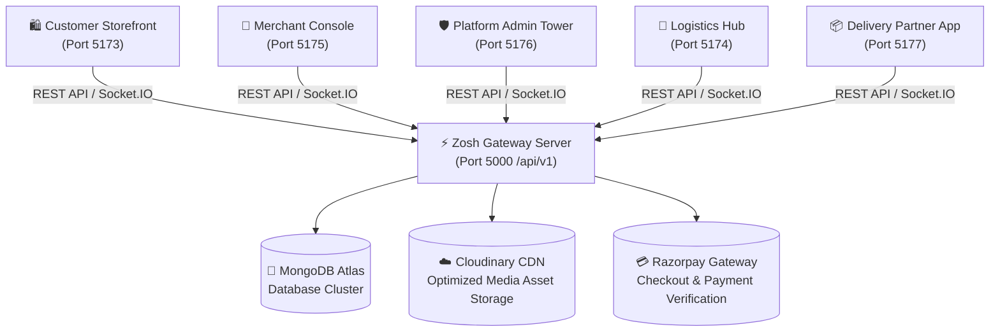

# 🛍️ Zosh Bazaar — Enterprise Multi-Vendor E-Commerce Platform

<div align="center">

[](./LICENSE)
[](https://react.dev/)
[](https://www.typescriptlang.org/)
[](https://nodejs.org/)
[](https://expressjs.com/)
[](https://www.mongodb.com/atlas)
[](https://socket.io/)
[](https://tailwindcss.com/)
[](https://vitejs.dev/)

**An industry-grade, event-driven multi-vendor marketplace platform built for scale, resilience, and real-time operational excellence.**

[Live Storefront](http://localhost:5173) • [Logistics Tower](http://localhost:5174) • [Seller Console](http://localhost:5175) • [Platform Admin](http://localhost:5176) • [Delivery App](http://localhost:5177)

</div>

---

## 📑 Table of Contents

- [Architectural Overview](#-architectural-overview)
- [Multi-Portal Ecosystem & Port Mapping](#-multi-portal-ecosystem--port-mapping)
- [Key Enterprise Features](#-key-enterprise-features)
  - [1. Customer Discovery & Experience](#1-customer-discovery--experience)
  - [2. Merchant Operating System](#2-merchant-operating-system)
  - [3. Logistics Control Tower](#3-logistics-control-tower)
  - [4. Platform Governance & RBAC](#4-platform-governance--rbac)
  - [5. Delivery Partner Verification (OTP Handshake)](#5-delivery-partner-verification-otp-handshake)
- [Repository Directory Structure](#-repository-directory-structure)
- [Technology Stack Matrix](#-technology-stack-matrix)
- [Core API Endpoints Matrix](#-core-api-endpoints-matrix)
- [Environment Setup & Configuration](#-environment-setup--configuration)
- [Local Development Setup](#-local-development-setup)
- [Testing & Quality Verification](#-testing--quality-verification)
- [Production Deployment Guide](#-production-deployment-guide)
- [Security & Governance](#-security--governance)
- [License](#-license)

---

## 🏛️ Architectural Overview

Zosh Bazaar operates on a decoupled micro-frontend + unified backend architecture. Specialized personas (customers, vendors, platform admins, logistics dispatchers, delivery agents) access custom-tailored web interfaces that synchronize state in real time via REST APIs and WebSocket events.



---

## 🌐 Multi-Portal Ecosystem & Port Mapping

| Application | Port | User Persona | Primary Responsibilities |
| :--- | :---: | :--- | :--- |
| **Storefront (`client`)** | `:5173` | End Consumer | Product discovery, live pincode detection, multi-tier mega menus, persistent cart, wishlist, Razorpay checkout, AI chatbot assistant. |
| **Logistics Tower (`logistics`)** | `:5174` | Dispatch Operators | Hub routing, package manifests, route optimization, real-time driver tracking, delivery exception resolution. |
| **Merchant Console (`seller`)** | `:5175` | Independent Sellers | Catalog creation, bulk Cloudinary asset uploads, inventory monitoring, fulfillment tracking, payout metrics. |
| **Platform Admin (`admin`)** | `:5176` | System Executives | Vendor KYC audits, category tree management, platform commission policies, financial dispute settlements. |
| **Delivery Partner (`delivery-partner`)** | `:5177` | Field Drivers | Active delivery queue, customer routing, OTP verification handshake, contactless proof of delivery. |
| **Backend Core (`server`)** | `:5000` | Platform Core | Central REST micro-services, real-time Socket.IO room hub, dynamic CORS resolution, JWT authentication, scheduled workers. |

---

## 🚀 Key Enterprise Features

### 1. Customer Discovery & Experience

- **Realtime Pincode & Locality Detection**: Auto-detects delivery pincode via browser Geolocation + reverse geocoding fallback, instantly filtering serviceable inventory.
- **Fixed Zero-Shift Sticky Navigation**: Full mega menu and brand subheader remain pinned during scrolling without layout snapping.
- **AI Shopping Assistant**: In-page conversational chatbot with container-scoped auto-scrolling that does not jar page scroll position.
- **Seamless Razorpay Integration**: Secure checkout with webhook verification and payment status callbacks.

### 2. Merchant Operating System

- **Media Asset Pipeline**: Direct client-to-Cloudinary drag-and-drop file upload with automated thumbnail extraction.
- **Real-time Order Alerts**: Instant desktop notifications powered by WebSocket room subscriptions (`seller_{sellerId}`).
- **Financial Analytics**: Transparent breakdown of Gross Merchandise Value (GMV), platform deductions, and net payouts.

### 3. Logistics Control Tower

- **Automated Hub Dispatch**: Smart algorithm routes parcels to the nearest fulfillment center based on delivery postal code.
- **Driver Fleet Telemetry**: Live agent status monitoring (`IDLE`, `EN_ROUTE`, `DELIVERING`).

### 4. Platform Governance & RBAC

- **Strict Privilege Isolation**: Server-level middleware enforces strict role guards:
  - `ROLE_CUSTOMER`
  - `ROLE_SELLER`
  - `ROLE_ADMIN`
  - `ROLE_LOGISTICS_OPERATOR`
  - `ROLE_DELIVERY_AGENT`
- **Universal Command Palette (`Ctrl/Cmd + K`)**: Lightning-fast administrative search indexing products, sellers, orders, and system settings.

### 5. Delivery Partner Verification (OTP Handshake)

- **Tamper-proof Handshake**: Orders cannot be marked as delivered without providing a cryptographically generated 6-digit OTP sent to the customer upon dispatch.

---

## 📂 Repository Directory Structure

```text
Multivendor_Ecommerce ZoshBazaar/
├── client/                     # Customer Storefront (Vite + React + TS)
├── seller/                     # Vendor Operating System (Vite + React + TS)
├── admin/                      # Platform Admin Console (Vite + React + TS)
├── logistics/                  # Logistics Control Tower (Vite + React + TS)
├── delivery-partner/           # Last-Mile Delivery Agent App (Vite + React + TS)
├── server/                     # Monolithic API & WebSocket Hub (Node + Express)
│   ├── src/
│   │   ├── config/             # Dynamic CORS, DB, Razorpay, Redis
│   │   ├── db/                 # MongoDB connection lifecycle
│   │   ├── middlewares/        # RBAC, JWT verification, rate limiters
│   │   ├── models/             # Mongoose schemas (Orders, Products, Hubs, etc.)
│   │   ├── modules/            # Domain controllers & services (Customer, Seller, Admin, etc.)
│   │   ├── realtime/           # Socket.IO event router & room managers
│   │   └── workers/            # Lifecycle & account deletion cron tasks
├── scratch/                    # Verification scripts & integration tests
├── .gitignore                  # Monorepo git hygiene
├── .markdownlint.json          # Enterprise markdown formatting rules
├── LICENSE                     # MIT License
├── package.json                # Monorepo workspaces & dev scripts
└── README.md                   # System documentation
```

---

## 🛠️ Technology Stack Matrix

| Layer | Technologies |
| :--- | :--- |
| **Frontends** | React 19 / 18, Vite 5, TypeScript 5, Tailwind CSS 3, Material UI (MUI), Lucide & MUI Icons |
| **State Management** | Redux Toolkit (RTK), RTK Query, React Context API |
| **Networking & Sockets** | Axios with request/response interceptors, `socket.io-client` |
| **Backend Framework** | Node.js (ES Modules), Express.js, Compression, Morgan, Body-Parser |
| **Database & ODM** | MongoDB Atlas, Mongoose ODM |
| **Authentication** | JSON Web Tokens (JWT), Bcrypt password hashing |
| **Payments** | Razorpay Node.js SDK |
| **Cloud Media** | Cloudinary v2 REST Image API |
| **Testing & Linting** | TypeScript compiler (`tsc --noEmit`), Oxlint, Markdownlint |

---

## 🔌 Core API Endpoints Matrix

### Customer Domain (`/api/v1`)

- `POST /api/v1/auth/signup` — User account registration
- `POST /api/v1/auth/signin` — Authenticate and receive JWT token
- `GET /api/v1/products` — Filtered, paginated marketplace catalogue search
- `GET /api/v1/cart` — User persistent shopping cart retrieval
- `POST /api/v1/orders/create` — Initialize multi-vendor order checkout
- `POST /api/v1/payment/razorpay/verify` — Verify cryptographic Razorpay signature

### Seller Domain (`/api/v1/seller`)

- `POST /api/v1/seller/register` — Vendor onboarding & shop creation
- `GET /api/v1/seller/products` — Retrieve seller-specific inventory
- `POST /api/v1/seller/products` — Add new product with attributes & variants
- `GET /api/v1/seller/orders` — Orders assigned to the authenticated merchant
- `GET /api/v1/seller/reports` — Daily, weekly, and monthly revenue analytics

### Administration Domain (`/api/v1/admin`)

- `GET /api/v1/admin/sellers` — View pending, approved, and suspended vendors
- `PATCH /api/v1/admin/sellers/:id/status` — Approve or revoke seller license
- `GET /api/v1/admin/orders` — Platform-wide multi-order oversight
- `POST /api/v1/admin/coupons` — Create marketplace discount vouchers

### Logistics & Delivery Domain (`/api/v1/logistics` & `/api/v1/delivery-partner`)

- `GET /api/v1/logistics/hubs` — Active fulfillment centers and capacities
- `POST /api/v1/logistics/shipments/assign` — Dispatch shipment to delivery agent
- `POST /api/v1/delivery-partner/verify-otp` — Complete delivery via 6-digit customer OTP

---

## ⚙️ Environment Setup & Configuration

Each folder includes an `.env.example` and `.env.sample` with pre-defined keys.

### Server Configuration (`server/.env`)

```env
# Server Runtime
PORT=5000
NODE_ENV=development
SERVER_URL=http://localhost:5000

# Portals for Dynamic CORS and Navigation
CLIENT_URL=http://localhost:5173
LOGISTICS_URL=http://localhost:5174
SELLER_URL=http://localhost:5175
ADMIN_URL=http://localhost:5176
DELIVERY_PARTNER_URL=http://localhost:5177
ALLOWED_ORIGINS=http://localhost:5173,http://localhost:5174,http://localhost:5175,http://localhost:5176,http://localhost:5177

# Database & Security
MONGODB_URI=mongodb+srv://<user>:<password>@cluster.mongodb.net/zosh-bazaar
JWT_SECRET_KEY=your_secure_32_char_jwt_secret

# Email & Payment Integrations
EMAIL_ADDRESS=notifications@zoshbazaar.com
EMAIL_PASSWORD=your_email_service_password
RAZORPAY_TEST_KEY_ID=rzp_test_your_key_id
RAZORPAY_TEST_KEY_SECRET=your_razorpay_secret
```

### Frontend Configuration (`client/.env`, `seller/.env`, etc.)

```env
# Base API and Realtime Engine
VITE_API_BASE_URL=http://localhost:5000/api/v1
VITE_API_URL=http://localhost:5000/api/v1
VITE_SOCKET_URL=http://localhost:5000

# Inter-Portal Links
VITE_STOREFRONT_URL=http://localhost:5173
VITE_SELLER_PORTAL_URL=http://localhost:5175
VITE_ADMIN_PORTAL_URL=http://localhost:5176
VITE_LOGISTICS_PORTAL_URL=http://localhost:5174

# Cloudinary Integration (Customer & Seller)
VITE_CLOUDINARY_CLOUD_NAME=your_cloud_name
VITE_CLOUDINARY_UPLOAD_PRESET=your_preset_name
```

---

## 💻 Local Development Setup

### 1. Prerequisites

- **Node.js**: `v18.x` or higher (Recommended: `v20.x` or `v22.x`)
- **npm**: `v9.x` or higher
- **MongoDB**: Active MongoDB Atlas cluster or local instance running on port `27017`

### 2. Clone Repository & Setup Environments

```bash
# Clone repository
git clone https://github.com/Rahul-2148/Zosh-Bazaar-Multivendor-Ecommerce.git
cd Zosh-Bazaar-Multivendor-Ecommerce

# Copy environment templates
cp server/.env.example server/.env
cp client/.env.example client/.env
cp seller/.env.example seller/.env
cp admin/.env.example admin/.env
cp logistics/.env.example logistics/.env
cp delivery-partner/.env.example delivery-partner/.env
```

### 3. Install All Monorepo Dependencies

```bash
npm install
npm --prefix server install
npm --prefix client install
npm --prefix seller install
npm --prefix admin install
npm --prefix logistics install
npm --prefix delivery-partner install
```

### 4. Start Development Services

Run individual services concurrently or separately:

```bash
# Backend Server & Realtime WebSocket Hub (Port 5000)
npm run dev:server

# Customer Web Storefront (Port 5173)
npm run dev:client

# Vendor / Merchant Console (Port 5175)
npm run dev:seller

# Platform Admin Console (Port 5176)
npm run dev:admin

# Logistics Control Tower (Port 5174)
npm run dev:logistics

# Delivery Partner Mobile Web App (Port 5177)
npm run dev:partner
```

---

## 🧪 Testing & Quality Verification

### Run Monorepo TypeScript Checks

Run static typing validation across all 5 frontend apps simultaneously:

```bash
npm run typecheck:all
```

### Run Environment & CORS Consistency Test

Verify that all environment files are synchronized and CORS origins resolve:

```bash
node scratch/test_env_resolution.mjs
```

---

## 🚢 Production Deployment Guide

1. **Build Production Bundles**:

   ```bash
   npm run build:all
   ```

2. **Configure Multi-Domain CORS**:
   In your production deployment environment (e.g. Render, Railway, AWS ECS), set `ALLOWED_ORIGINS`:

   ```env
   ALLOWED_ORIGINS=https://zoshbazaar.com,https://seller.zoshbazaar.com,https://admin.zoshbazaar.com,https://logistics.zoshbazaar.com,https://delivery.zoshbazaar.com
   ```

3. **Deploy Frontends**:
   Deploy the `dist/` directories of `client`, `seller`, `admin`, `logistics`, and `delivery-partner` to Vercel, Netlify, or Cloudflare Pages with their respective production environment variables.

---

## 🔒 Security & Governance

- **Credentials Sanitization**: No credentials, secrets, or API keys are tracked in git.
- **Origin Whitelisting**: Automated verification protects WebSocket rooms and HTTP routes against cross-site scripting and unauthorized domain origin requests.
- **Secure Sessions**: Authentication tokens are transmitted over TLS with strict signature verification.

---

## 📄 License

Distributed under the MIT License. See [LICENSE](./LICENSE) for details.

Copyright © 2026 **Rahul Raj Modi**. All rights reserved.
